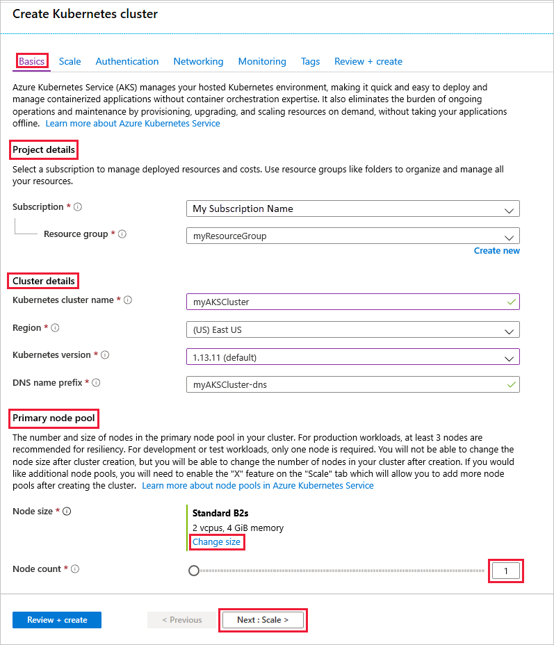
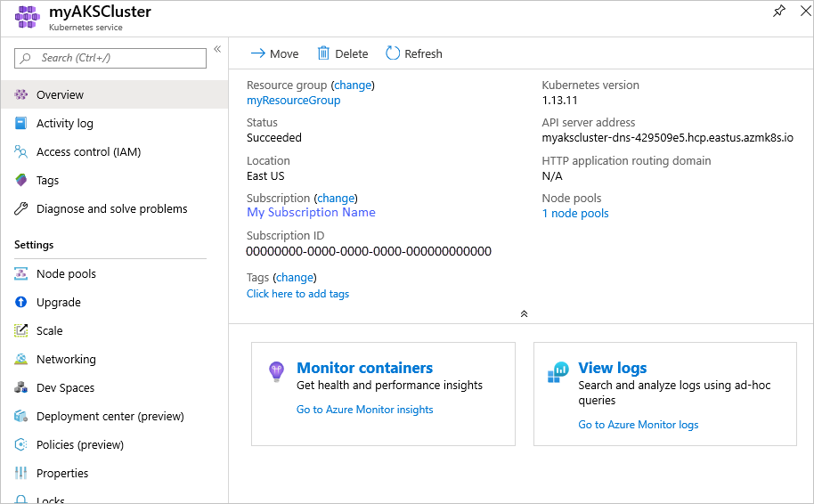
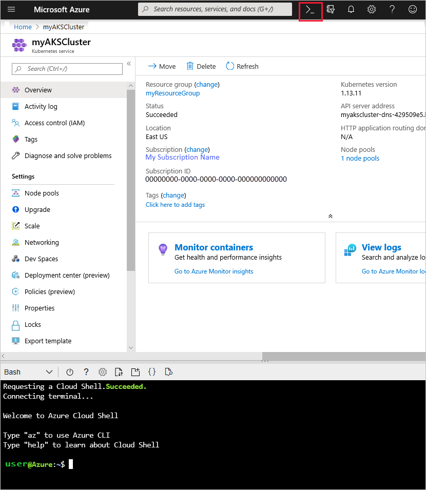

This it post
# Quickstart: Deploy an Azure Kubernetes Service (AKS) cluster using the Azure portal

Azure Kubernetes Service (AKS) is a managed Kubernetes service that lets you quickly deploy and manage clusters. In this quickstart, you deploy an AKS cluster using the Azure portal.

This quickstart assumes a basic understanding of Kubernetes concepts. For more information, see [Kubernetes core concepts for Azure Kubernetes Service (AKS)][kubernetes-concepts].

If you don't have an Azure subscription, create a [free account](https://azure.microsoft.com/free/?WT.mc_id=A261C142F) before you begin.

## Sign in to Azure

Sign in to the Azure portal at [https://portal.azure.com](https://portal.azure.com).

## Create an AKS cluster

To create an AKS cluster, complete the following steps:

1. On the Azure portal menu or from the **Home** page, select **Create a resource**.

2. Select **Containers** >  **Kubernetes Service**.

3. On the **Basics** page, configure the following options:
    - **Project details**: Select an Azure **Subscription**, then select or create an Azure **Resource group**, such as *myResourceGroup*.
    - **Cluster details**: Enter a **Kubernetes cluster name**, such as *myAKSCluster*. Select a **Region**, **Kubernetes version**, and **DNS name prefix** for the AKS cluster.
    - **Primary node pool**: Select a VM **Node size** for the AKS nodes. The VM size *can't* be changed once an AKS cluster has been deployed. 
            - Select the number of nodes to deploy into the cluster. For this quickstart, set **Node count** to *1*. Node count *can* be adjusted after the cluster has been deployed.
    
    

    Select **Next: Scale** when complete.

4. On the **Scale** page, keep the default options. At the bottom of the screen, click **Next: Authentication**.
    > [!CAUTION]
    > Creating new AAD Service Principals may take multiple minutes to propagate and become available causing Service Principal not found errors and validation failures in Azure portal. If you hit this please visit [here](troubleshooting.md#received-an-error-saying-my-service-principal-wasnt-found-or-is-invalid-when-i-try-to-create-a-new-cluster) for mitigation.

5. On the **Authentication** page, configure the following options:
    - Create a new service principal by leaving the **Service Principal** field with **(new) default service principal**. Or you can choose *Configure service principal* to use an existing one. If you use an existing one, you will need to provide the SPN client ID and secret.
    - Enable the option for Kubernetes role-based access control (RBAC). This will provide more fine-grained control over access to the Kubernetes resources deployed in your AKS cluster.

    Alternatively, you can use a managed identity instead of a service principal. See [use managed identities](use-managed-identity.md) for more information.

By default, *Basic* networking is used, and Azure Monitor for containers is enabled. Click **Review + create** and then **Create** when validation completes.

It takes a few minutes to create the AKS cluster. When your deployment is complete, click **Go to resource**, or  browse to the AKS cluster resource group, such as *myResourceGroup*, and select the AKS resource, such as *myAKSCluster*. The AKS cluster dashboard is shown, as in this example:



## Connect to the cluster

To manage a Kubernetes cluster, you use [kubectl][kubectl], the Kubernetes command-line client. The `kubectl` client is pre-installed in the Azure Cloud Shell.

Open Cloud Shell using the `>_` button on the top of the Azure portal.



To configure `kubectl` to connect to your Kubernetes cluster, use the [az aks get-credentials][az-aks-get-credentials] command. This command downloads credentials and configures the Kubernetes CLI to use them. The following example gets credentials for the cluster name *myAKSCluster* in the resource group named *myResourceGroup*:

```azurecli
az aks get-credentials --resource-group myResourceGroup --name myAKSCluster
```

To verify the connection to your cluster, use the [kubectl get][kubectl-get] command to return a list of the cluster nodes.

```console
kubectl get nodes
```

The following example output shows the single node created in the previous steps. Make sure that the status of the node is *Ready*:

```output
NAME                       STATUS    ROLES     AGE       VERSION
aks-agentpool-14693408-0   Ready     agent     15m       v1.11.5
```
